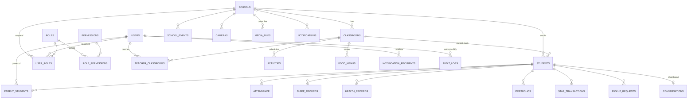
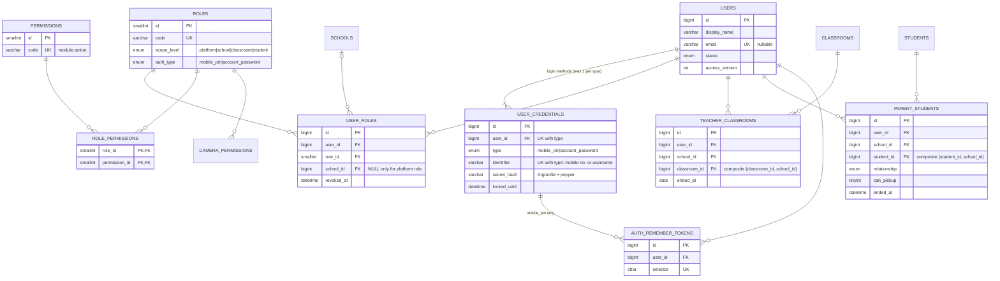
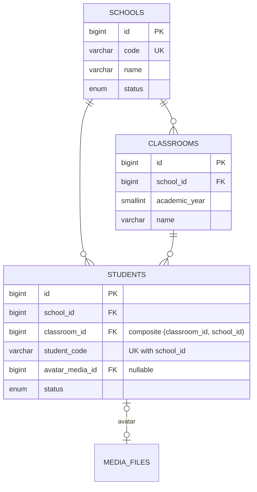
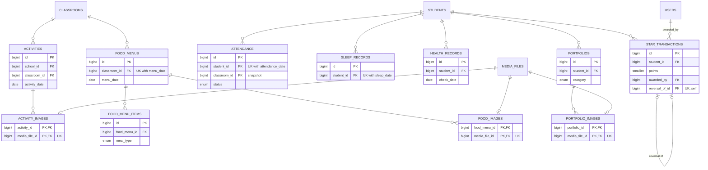
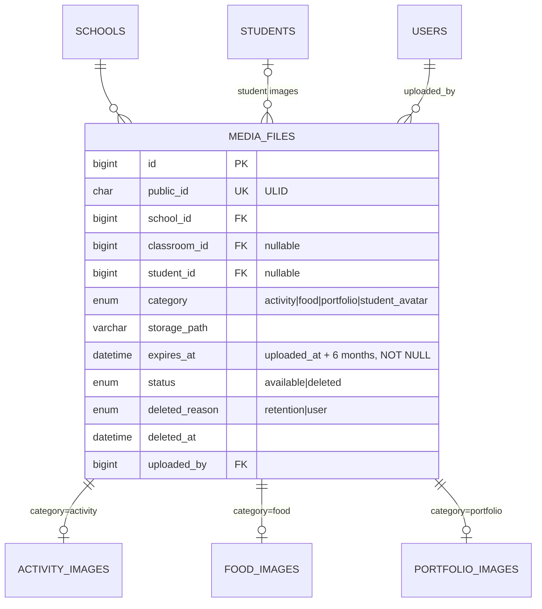
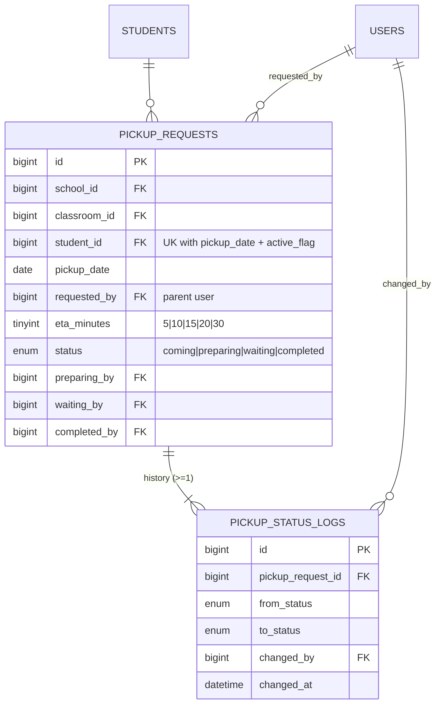
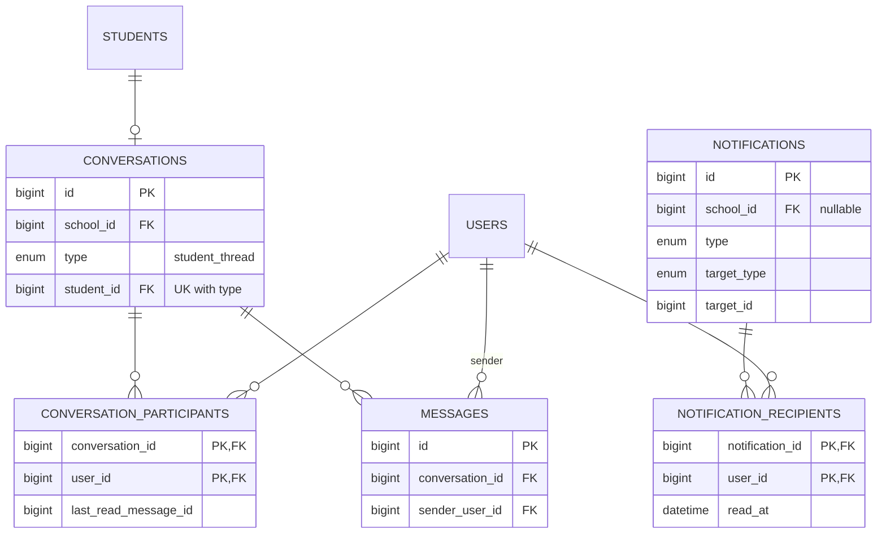
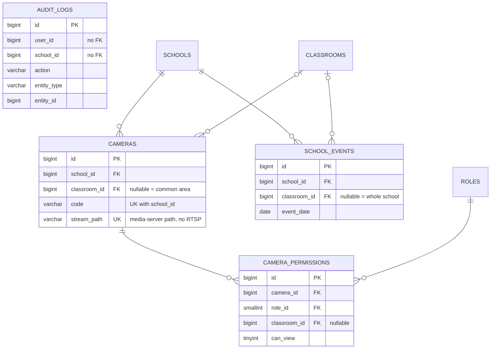

# Database ERD

> รายละเอียดคอลัมน์: [database.md](database.md) · สัญลักษณ์ Mermaid: `||--o{` = หนึ่งต่อศูนย์หรือหลาย, `|o--o{` = ศูนย์หรือหนึ่งต่อหลาย
> ใน diagram แสดงเฉพาะคีย์และคอลัมน์ที่เกี่ยวกับความสัมพันธ์ เพื่อให้อ่านง่าย

## 1. Overview (ทุกโดเมน)

## 2. Identity & Access (RBAC + Scope)

## 3. Organization & Students

## 4. Daily Operations, Portfolio, Stars

> ตาราง PENDING BUSINESS CONFIRMATION (`food_intakes`, `classroom_status_logs`, `development_assessments`) ผูกกับ `STUDENTS`/`CLASSROOMS`
> แบบเดียวกับ daily records — ไม่แสดงใน diagram เพื่อลดความซับซ้อน

## 5. Media (กลาง) + Owner

Retention: ไฟล์จริงถูกลบอัตโนมัติเมื่อครบ 6 เดือน → `status='deleted'`; **record ใน `MEDIA_FILES` และ join table และ owner คงอยู่ทั้งหมด** (FK เป็น RESTRICT ไม่มี CASCADE)

กติกา: ภาพ 1 ไฟล์มี owner ได้ **หนึ่งเดียว** (`media_file_id` UNIQUE ใน join table) และ `category` ต้องตรงกับ join table
(ตรวจใน `MediaService` + test)

## 6. Pickup / รับ-ส่ง

## 7. Chat & Notification

## 8. CCTV, Calendar, Audit

## 9. Relationship Summary

| From | To | Cardinality | Enforced by |
|---|---|---|---|
| School | Classroom | 1 : N | FK `classrooms.school_id` |
| School | Student | 1 : N | FK + composite FK ผ่าน classroom (เด็กอยู่โรงเรียนเดียวกับห้อง) |
| Classroom | Student | 1 : N (ห้องปัจจุบัน) | composite FK `(classroom_id, school_id)` |
| Student | Parent (User) | N : M | `parent_students` (+ relationship, can_pickup, ended_at) |
| Teacher (User) | Classroom | N : M | `teacher_classrooms` (+ ended_at) |
| School | Teacher/Admin/Executive/Parent (User) | N : M ผ่าน role | `user_roles.school_id` |
| User | Credential | 1 : 1..2 (สูงสุด 1 ต่อชนิด) | `user_credentials` UNIQUE `(user_id, type)` และ `(type, identifier)` |
| User | Role → Permission | N : M → N : M | `user_roles`, `role_permissions`; role ใช้ได้เฉพาะเมื่อ login ด้วย credential ตาม `roles.auth_type` |
| Student | Portfolio / Stars / Attendance / Sleep / Health / Pickup | 1 : N | composite FK `(student_id, school_id)` |
| Portfolio / Activity / Food menu | Media file | 1 : N (ภาพ 1 ไฟล์มี owner เดียว) | join table + `media_file_id` UNIQUE |
| Pickup request | Status log | 1 : N (≥1) | FK + เขียนใน transaction เดียว |
| Student | Conversation | 1 : 0..1 (`student_thread`) | UNIQUE `(type, student_id)` |
| Conversation | Message / Participant | 1 : N | FK |
| Notification | User | N : M | `notification_recipients` |
| School | Camera | 1 : N | FK; Camera → Classroom 0..1 |
| Camera | Role | N : M (+ห้อง) | `camera_permissions` |
| Audit log | User / School | N : 0..1 | **ไม่มี FK** (log ต้องอยู่ได้แม้ข้อมูลอ้างอิงเปลี่ยน) |

## 10. Consistency Check (ตรวจแล้ว)

| ความเสี่ยงที่ตรวจ | ผล |
|---|---|
| เด็กอยู่ห้องของอีกโรงเรียน | ป้องกันโดย composite FK `students(classroom_id, school_id)` |
| Daily record ชี้เด็กโรงเรียนอื่น | composite FK `(student_id, school_id)` ทุกตาราง |
| Teacher ผูกห้องโรงเรียนที่ตัวเองไม่มี role | DB ป้องกัน school ของห้อง; การมี role TEACHER ใน school นั้นตรวจใน `RoleAssignmentService` (ข้ามตารางเกินกว่าที่ FK ทำได้ — ไม่ใช้ trigger เพื่อความเรียบง่าย) |
| Parent ผูกเด็กโดยไม่มี role PARENT | ตรวจใน `StudentService::linkParent` + test |
| ภาพ 1 ไฟล์ถูกใช้หลาย owner | UNIQUE `media_file_id` ในแต่ละ join table; ข้าม join table ตรวจด้วย `category` |
| รับ-ส่งซ้อนกันของเด็กคนเดียว | UNIQUE `(student_id, pickup_date, active_flag)` |
| สถานะรับ-ส่งข้ามขั้น / แข่งกันกด | `UPDATE … WHERE status = :from` + state machine ใน `PickupService` |
| ดาวถูกแก้ย้อนหลัง | ledger ไม่มี UPDATE/DELETE, แก้ด้วย reversal (`reversal_of_id` UNIQUE = กลับรายการได้ครั้งเดียว) |
| ลบ user แล้วประวัติหาย | ไม่ลบ user จริง (`status=disabled`), FK `RESTRICT`, audit ไม่มี FK |
| วงจร FK (`students.avatar_media_id` ↔ `media_files.student_id`) | ทั้งคู่ nullable → insert เด็กก่อน, ภาพทีหลัง, แล้ว update avatar — ไม่ติด |
| ลบ owner แล้วภาพกำพร้า | owner ใช้ soft delete; ภาพยังผูกอยู่และไฟล์ถูกลบอัตโนมัติตาม retention ปกติ |
| ลบไฟล์ภาพแล้ว business record หาย | เป็นไปไม่ได้: retention เปลี่ยนแค่ `status` (ไม่ DELETE แถว) และทุก FK เป็น `RESTRICT` ไม่มี `CASCADE` |
